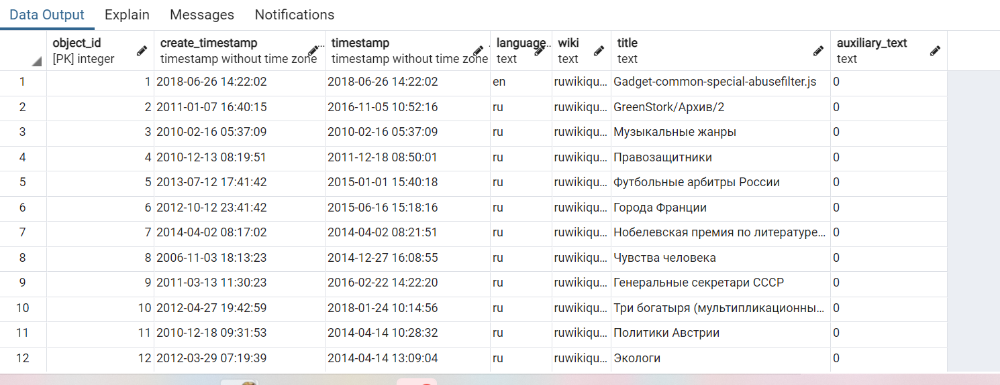
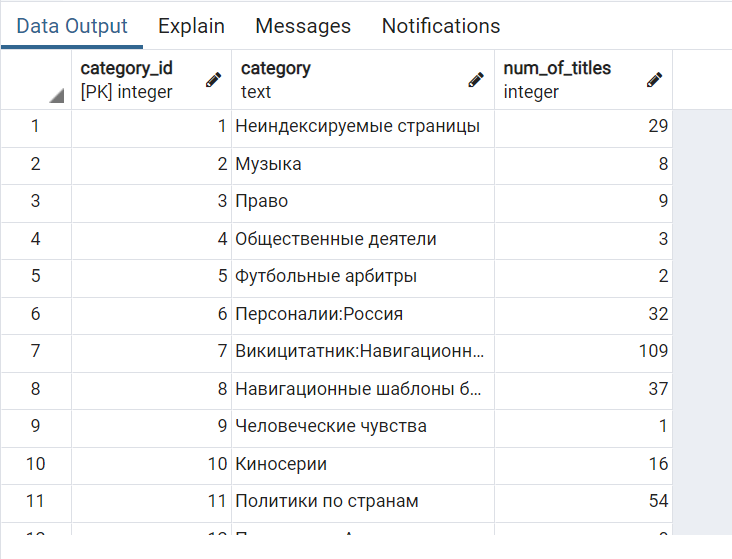
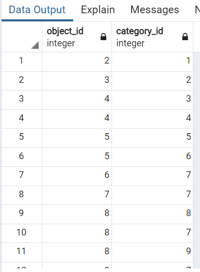
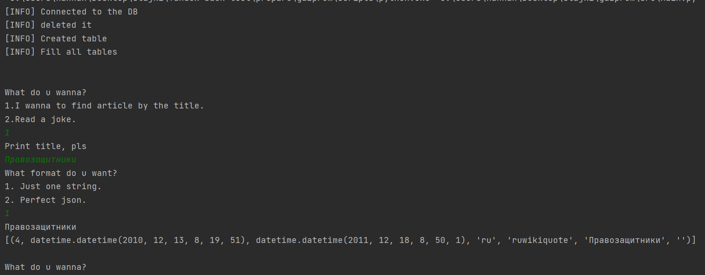

**ИНФО**  
> **В данной версии проекта**  
> * парсится json файл
> * создаются таблицы json объектов и категорий в бд  
> * создана дополнительная таблица связей между объектами и категориями (многие ко многим)
> * создаются записи в таблице объектов
> 
> * создаются неповторяющиеся записи в таблице категорий и считается количество статей с этой категорией *(хотя вообще это можно и запросиком sql было бы считать...)*
> 
> * создаются записи в таблице соединений  
> 
> * функция для поиска по полю *title*... *Пока без форматирования*  
> 

> **Необходимо сделать**
> * Сделать функции для формирования json файлов как надо
> * Развернуть все это дело на веб-страничке при помощи PlayFramework так, чтобы брать аргументы запроса из строки поиска
****

**Инструкция**
> **для импорта в postgreSQL:**  
> * создать БД
> * указать ее имя, пароль и логин от postgres в *Resources\config.py*
> * добавить в папку с проектом файл json и указать его название как Resources\*filename* в *Resources\config.py*  
> * запустить проект
> 
> **Для получения информации:**
> * продолжить общаться с системой в консольки *(пока что)*